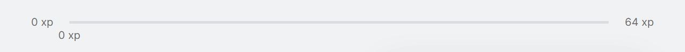

# About the Project
Move it was build during the 4º edition of [Next Level Week](https://nextlevelweek.com/) event by [Rocketseat](https://rocketseat.com.br/).

The objective of the project is to force the user to take a break every 25 minutes and do an exercise before continue using the computer.

When the timer reach zero a sound notification on the browser was triggered and a new challenge appears. If the user completes the challenge, he earn experience points, when earned enough experience points, the user level up.

##### Functionalities added besides the event

* Experience points bar moving dynamic;
* Current experience incresses dynamic;

### How to run locally
To run the application is needed to clone the repository on the directory that the application will be in your computer using the following command: `git clone https://github.com/everton-araujo/nlw-moveit.git`.

Now that the project is locally, go to the directory where the project was cloned and install the dependencies:

* Using yarn: `yarn`;
* Using npm: `npm install`;

After all dependencies was installed, run the following command to run the application:

* Using yarn: `yarn dev`;
* Using npm: `npm run dev`;

### Techs used

The application was build using the following technologies:

* React JS;
* Next;
* Typescript;
